## Auditing privileged users 

### Perform

1. Access [keys](https://portal.azure.com/#@thx138.onmicrosoft.com/resource/subscriptions/3539c2a2-cd25-48c6-b295-14e59334ef1c/resourceGroups/queryStorage-2637/providers/Microsoft.Storage/storageAccounts/storagezktkqnknnv/keys) as aaron.butler@m.dewi.red

2. Wait 1-2 mins for audit logs to appear
    
    ``node ./plugins/main.js --batch=10 --nativescope=true --roleAssignments --subInclude=3539c2a2-cd25-48c6-b295-14e59334ef1c --namespace=null --scanAuditLogs=1 --clearTokens  --includeRG `` 

### [``scanAuditLogs``](providers/microsoft.authorization/functions/Subscription_scanAuditLogs.js)

This control audits privileged operations on Azure Activity logs to be backed by strong authentication methods

### [``Subscriptions_roleAssignmentsRGAdvanced``](providers/microsoft.authorization/functions/Subscriptions_roleAssignmentsRGAdvanced.js)


This control audits objects in ``roleAssignments`` via ``what-if`` API to be required for strong authentication

---

**Inspection basis**

| Object | key                                                                | value                                        |
| ------ | ------------------------------------------------------------------ | -------------------------------------------- |
| user   | ``["http://schemas.microsoft.com/claims/authnmethodsreferences"]`` | ``RSA`` or ``MFA`` for strong authentication |
| app    | ``appIdAcr``                                                       | ``2`` for strong authentication              |

---


### how MFA / RSA claims are logged in Azure Activity Logs?

```mermaid
sequenceDiagram
    participant jdoe
    participant AAD
    participant ARM
    jdoe ->> AAD: Requests for Access token
    AAD ->> AAD: Checks Conditional Access for jdoe, no MFA required
    AAD -->> jdoe: issues access_token
    jdoe ->> ARM: calls Azure Resource Manager with the access_token 
    Note left of ARM: authnmethodsreferences without MFA or RSA <br> logged to activity log ⚠ 
    ARM -->> jdoe: responds 
    Note right of jdoe: <content> 
```



### example WHAT-IF api results

```js
// user: aaron.butler_m.dewi.red#EXT#@thx138.onmicrosoft.com 

// what-if api results
    mfaResults = {
        "basicAuth": {
          "oid": "d73f951e-1a61-4def-b657-199495e3d9ca",
          "appliedPol": [{
            "GrantConditions": "blockAccess",
            "policy": "CA003: Block legacy authentication",
            "oid": "d73f951e-1a61-4def-b657-199495e3d9ca"
          }],
          "checkType": "basicAuth"
        },
        "MFAstatus": {
          "oid": "d73f951e-1a61-4def-b657-199495e3d9ca",
          "appliedPol": [],
          "checkType": "mfa"
        }
      }

// ActivityLog results
    metadata={
        "weakAuthenticationEvents": ["UPN:aaron.butler@m.dewi.red : pwd"],
        "evaluated": 17
    }
```


### Additional info

Consider running [CAOptics](https://github.com/jsa2/caOptics) If you want perform extensive audit of Conditional Access Policies
