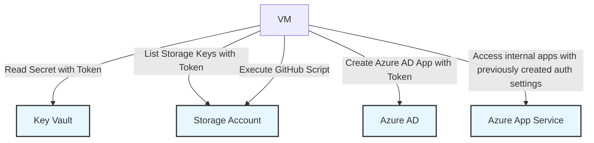

# Raw Session notes from 'FAUG goes Full Day Learning @ 29.2.2024'

These are just notes from the session. Running the same demos in your environment requires modifications and filling some gaps, so the scripts mostly serve as insipiration and starting point

## Presentation

[Public Session notes - raw presentation- Finnish Azure User Group At Microsoft Finland 29.2.2024](/Public%20Session%20notes%20-%20raw%20presentation-%20Finnish%20Azure%20User%20Group%20At%20Microsoft%20Finland%2029.2.2024.pdf)

// Image credits https://giphy.com/explore/hacking

## Demos
1. Actor in the middle attacks provisioning script [AITMprovision.sh](/vmdemos/vmE2E/AITMprovision.sh)
 - This one includes the script to provision AITM tooling from ZIP package. Currently the flavour of the AITM tooling I am using is not available to public, but many other tools are available publicly such as https://github.com/kgretzky/evilginx2 
2. [Entra ID App Auditing](https://github.com/jsa2/AADAppAudit/blob/main/readme.md)
Provisions a VM that access the following sources
- Audit static permissions  [Entra ID App Auditing](https://github.com/jsa2/AADAppAudit/blob/main/readme.md)
- To use the demo you need to have existing log analytics workspace  example.``laws=hublaws`` , and at least following log sources enabled
- Run live audit in the workspace [appAudit.kql](./appAudit.kql)
 

