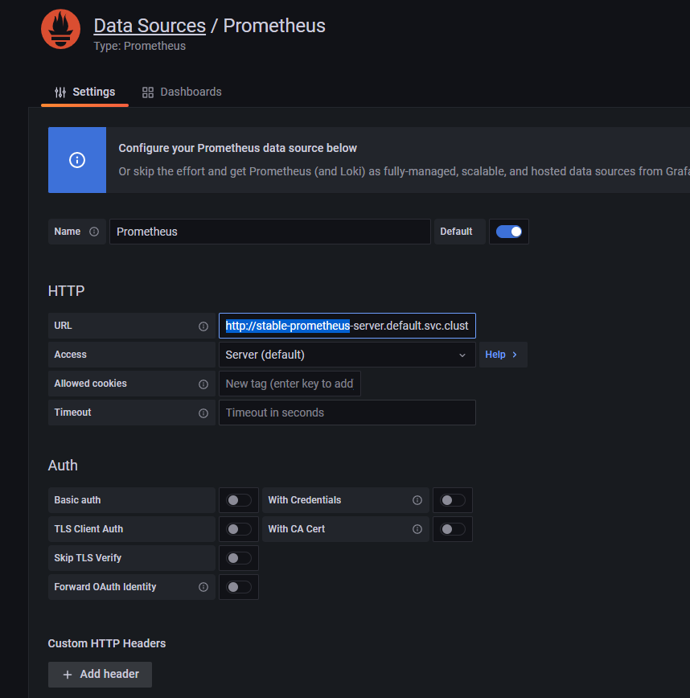
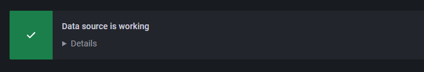
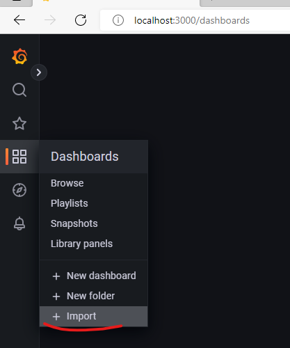
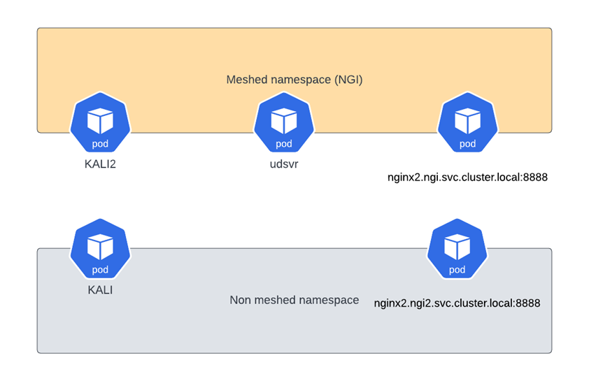
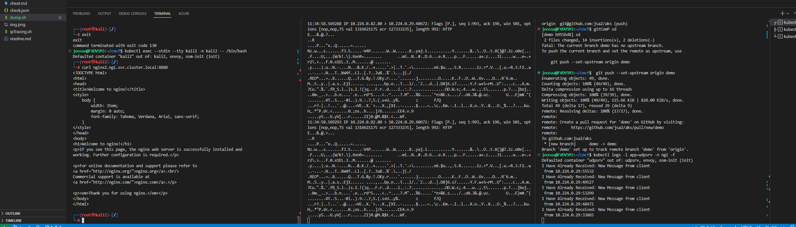

# Open Service Mesh Demo for CNCF (notes dump)

You can use the following setup snippets to replicate the demo environment used in the demo at *CNCF - Helsinki in September: Kubernetes and cloud native security*

- Provides also a way to setup Grafana and Prometheus for AKS-add-on, as these are not installed by default when using the add-on

--- 
**References** [ from MS Docs](https://docs.microsoft.com/en-us/azure/aks/open-service-mesh-about#capabilities-and-features) 

*Open Service Mesh (OSM) is a lightweight, extensible, cloud native service mesh that allows users to uniformly manage, secure, and get out-of-the-box observability features for highly dynamic microservice environments.*

*OSM runs an Envoy-based control plane on Kubernetes and can be configured with SMI APIs. OSM works by injecting an Envoy proxy as a sidecar container with each instance of your application. The Envoy proxy contains and executes rules around access control policies, implements routing configuration, and captures metrics. The control plane continually configures the Envoy proxies to ensure policies and routing rules are up to date and ensures proxies are healthy.*

*The OSM project was originated by Microsoft and has since been donated and is governed by the Cloud Native Computing Foundation [(CNCF)](https://www.cncf.io/).*

>**While not used in this demo, the bookstore demo is good if you want to test SMI policies**
>https://release-v0-11.docs.openservicemesh.io/docs/getting_started/quickstart/manual_demo/

---

- [Open Service Mesh Demo for CNCF (notes dump)](#open-service-mesh-demo-for-cncf-notes-dump)
- [Deploy MESH enabled cluster with Azure CLI to non-hardened setup](#deploy-mesh-enabled-cluster-with-azure-cli-to-non-hardened-setup)
  - [Enable OSM monitoring](#enable-osm-monitoring)
    - [Prometheus](#prometheus)
    - [Grafana](#grafana)
  - [Deploy namespaces and meshes](#deploy-namespaces-and-meshes)
- [labs](#labs)
  - [Setup IP tracing on multiple windows window](#setup-ip-tracing-on-multiple-windows-window)
  - [unmeshed to unmeshed - back to labs](#unmeshed-to-unmeshed---back-to-labs)
  - [unmeshed to meshed- back to labs](#unmeshed-to-meshed--back-to-labs)
  - [meshed to meshed- back to labs](#meshed-to-meshed--back-to-labs)
  - [unmeshed to meshed UDP service- back to labs](#unmeshed-to-meshed-udp-service--back-to-labs)
  - [IMDS and APIserver from meshed - back to labs](#imds-and-apiserver-from-meshed---back-to-labs)
  - [KALI(HostNetwork)](#kalihostnetwork)
  - [Clean-up](#clean-up)


# Deploy MESH enabled cluster with Azure CLI to non-hardened setup


```sh

NAME=aksf-$RANDOM
NAMER=RG-aks-$NAME
LOCATION=westeurope
NET="AKS-VNET_SR2"
TAGS="svc=aksdev"
ACR=honeypot

az group create -n $NAMER \
-l $LOCATION \
--tags $TAGS


az aks create \
-n ${NAME} -g ${NAMER} \
--enable-managed-identity \
--enable-aad \
-l $LOCATION  \
--enable-azure-rbac \
--network-plugin azure \
--network-policy azure \
--tags $TAGS \
--node-vm-size Standard_D4_v5 \
--enable-addons "open-service-mesh" \

az aks get-credentials --resource-group $NAMER --name $NAME --admin

kubectl get pod -o=custom-columns=NODE:.spec.nodeName,NAME:.metadata.name --all-namespaces | grep "osm"

kubectl describe meshconfig osm-mesh-config -n kube-system  

```


## Enable OSM monitoring

https://release-v1-0.docs.openservicemesh.io/docs/demos/prometheus_grafana/ 

https://release-v1-1.docs.openservicemesh.io/docs/guides/observability/metrics/


**In new window**

### Prometheus

```sh

helm repo add prometheus-community https://prometheus-community.github.io/helm-charts
helm repo update
helm install stable prometheus-community/prometheus

kubectl apply -f templates/monitoring/prometheus.yaml 
# Wait till all the pods are started up
sleep 30

kubectl get pods --all-namespaces | grep "prome"


```

### Grafana

```sh
helm repo add grafana https://grafana.github.io/helm-charts
helm repo update
helm install grafana grafana/grafana 

   kubectl get secret --namespace default grafana -o jsonpath="{.data.admin-password}" | base64 --decode ; echo

  export POD_NAME=$(kubectl get pods --namespace default -l "app.kubernetes.io/name=grafana,app.kubernetes.io/instance=grafana" -o jsonpath="{.items[0].metadata.name}")
     kubectl --namespace default port-forward $POD_NAME 3000

```

>take note of the output (below is only example, the previous step prints the correct values for output)


**Setup prometheus as data source**

access http://localhost:3000 

- If you have followed this tutorial the URL will be http://stable-prometheus-server.default.svc.cluster.local

  

> You should see following 

  

**Add dashboards**

> Dashboards are from OSM repo

Import following dashboards by copying their JSON contents

  

- [templates/monitoring/dashboards/osm-mesh-envoy-details.json](templates/monitoring/dashboards/osm-mesh-envoy-details.json)
- [templates/monitoring/dashboards/osm-control-plane.json](templates/monitoring/dashboards/osm-control-plane.json)
- [templates/monitoring/dashboards/osm-data-plane-performance.json](templates/monitoring/dashboards/osm-data-plane-performance.json)
- [templates/monitoring/dashboards/osm-pod-to-service.json](templates/monitoring/dashboards/osm-pod-to-service.json)


Check grafana

export POD_NAME=$(kubectl get pods -l "app.kubernetes.io/name=grafana" -n "kube-system" -o jsonpath="{.items[0].metadata.name}")
kubectl port-forward $POD_NAME 3000

--- 


## Deploy namespaces and meshes

```sh

#Meshed NGINIX
kubectl create namespace ngi
sleep 10
osm namespace add ngi
sleep 10
kubectl apply -f templates/runtime/nginx.yaml 
kubectl apply -f templates/runtime/svcNgi.yaml
kubectl describe -f templates/runtime/svcNgi.yaml  
kubectl rollout restart -f templates/runtime/nginx.yaml 
kubectl describe -f templates/runtime/nginx.yaml 
osm metrics enable --namespace ngi

#unmeshed KALI
kubectl create namespace kali
kubectl apply -f templates/runtime/kali.yaml 
sleep 10
kubectl exec --stdin --tty kali -n kali -- /bin/bash -c "apt update; apt install curl -y; apt install netcat-traditional -y"

#Meshed KALI
kubectl create namespace kali2
osm namespace add kali2
sleep 10
osm metrics enable --namespace kali2
sleep 10
kubectl apply  -f templates/runtime/kali2.yaml 
sleep 10
kubectl exec --stdin --tty kali2 -n kali2 -- /bin/bash -c "apt update; apt install curl -y; apt install netcat-traditional -y"
#

#unmeshed NGINX
kubectl create namespace ngi2
kubectl apply -f templates/non-meshed/NoMeshnginx.yaml
kubectl apply -f templates/non-meshed/NoMeshsvcNgi.yaml
kubectl describe -f templates/non-meshed/NoMeshnginx.yaml
kubectl describe -f templates/non-meshed/NoMeshsvcNgi.yaml

#UDP SRV in meshed namespace
kubectl apply -f templates/udpDemo/udpserver.yaml
kubectl apply -f templates/udpDemo/udpSvc.yaml

## KaliHost

kubectl apply -f templates/attack/kalihost.yaml
sleep 10
kubectl exec --stdin --tty kalihost -- /bin/bash -c "apt update; apt install curl -y"

#

```
# labs

  

Scenario | caller | destination | lab
-|-|-|-
1| unmeshed KALI | unmeshed NGINX | [LAB](#unmeshed-to-meshed)
2| unmeshed KALI | meshed NGINX | [LAB](#unmeshed-to-meshed)
3| meshed KALI | Meshed NGINX | [LAB](#meshed-to-meshed)
4| unmeshed KALI  | Meshed UDP service (with logs) | [LAB](#unmeshed-to-meshed-udp-service)
6| Meshed KALI( no HostNetwork) | IMDS | ["Pods that are onboarded to the mesh that need access to IMDS, Azure DNS, or the Kubernetes API server must have their IP addresses to the global list of excluded outbound IP ranges using"](https://docs.microsoft.com/en-us/azure/aks/open-service-mesh-about#add-on-limitations) - ❌ not true by default requires that permissive mode is disabled  <br> -> access [LAB](#imds-and-apiserver-from-meshed---back-to-labs)
7| Meshed KALI( no HostNetwork) | API server | ["Pods that are onboarded to the mesh that need access to IMDS, Azure DNS, or the Kubernetes API server must have their IP addresses to the global list of excluded outbound IP ranges using"](https://docs.microsoft.com/en-us/azure/aks/open-service-mesh-about#add-on-limitations) - ❌ not true by default requires that permissive mode is disabled <br> -> access [LAB](#imds-and-apiserver-from-meshed---back-to-labs)


## Setup IP tracing on multiple windows window 

[ipTracing](ipTracing.sh)

  


## unmeshed to unmeshed - [back to labs](#labs)
```sh
kubectl exec --stdin --tty kali -n kali -- /bin/bash
# Curl non-meshed service
curl nginx2.ngi2.svc.cluster.local:8888 
exit

```

## unmeshed to meshed- [back to labs](#labs)

```sh
kubectl exec --stdin --tty kali -n kali -- /bin/bash
# Curl meshed service
curl nginx2.ngi.svc.cluster.local:8888 
exit

```

## meshed to meshed- [back to labs](#labs)
```sh
kubectl exec --stdin --tty kali2 -n kali2 -- /bin/bash
curl nginx2.ngi.svc.cluster.local:8888 
exit

```

## unmeshed to meshed UDP service- [back to labs](#labs)
```sh
# on another window open the UDP logs
 kubectl logs -l app=udpsrv -n ngi -f
kubectl exec --stdin --tty kali2 -n kali2 -- /bin/bash
# Setup multiple windows as per IP tracing
# Curl UDP service
echo "New Message from client" | nc -u udpsrv.ngi.svc.cluster.local 6000 
exit
```

## IMDS and APIserver from meshed - [back to labs](#labs)


```sh
kubectl exec --stdin --tty kali2 -n kali2 -- /bin/bash
# Curl UDP service
# This dependes on set=osm.enablePermissiveTrafficPolicy=true
TOKEN=$(cat /var/run/secrets/kubernetes.io/serviceaccount/token)
curl --header "Authorization: Bearer ${TOKEN}" -X GET https://kubernetes.default.svc/api/v1/ --insecure
curl -s -H Metadata:true --noproxy "*" "http://169.254.169.254/metadata/instance?api-version=2017-08-01&format=text"
exit
# repeat with 
kubectl delete  -f templates/runtime/kali2.yaml
kubectl apply  -f templates/runtime/kali2.yaml 
kubectl exec --stdin --tty kali2 -n kali2 -- /bin/bash -c "apt update; apt install curl -y; apt install netcat-traditional -y"
kubectl exec --stdin --tty kali2 -n kali2 -- /bin/bash
kubectl patch meshconfig osm-mesh-config -n kube-system -p '{"spec":{"traffic":{"enablePermissiveTrafficPolicyMode":false}}}'  --type=merge


```


##  KALI(HostNetwork)
```sh
kubectl exec --stdin --tty kalihost -- /bin/bash
# Run https://github.com/jsa2/AKSdump/tree/main/containerToNode 
 
```


## Clean-up

```sh

kubectl delete namespace kali
kubectl delete namespace kali2
kubectl delete namespace ngi
kubectl delete namespace ngi2

rm ~/.kube/ -rf
az group delete -g $NAMER -y --no-wait

G=$(az group list --tag 'svc=aksdev' --query "[].{name:name}" -o tsv) 

for res in $G
do
 echo "az group delete --id $res"
 az group delete --name $res --no-wait -y
done

```

