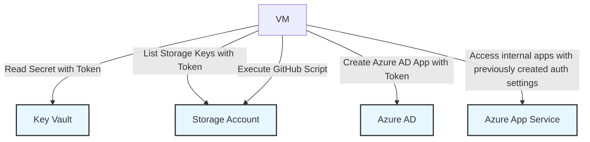

```mermaid
graph TD
    VM -->|Read Secret with Token| KV[Key Vault]
    VM -->|List Storage Keys with Token| Storage[Storage Account]
    VM -->|Create Azure AD App with Token| AzureAD[Azure AD]
    VM -->|Execute GitHub Script| Storage
    VM -->|Access internal apps with previously created auth settings | AzureWeb[Azure App Service] 

    classDef azure fill:#e6f7ff,stroke:#333,stroke-width:2px;
    class KV,Storage,AzureAD,AzureWeb azure;

```
